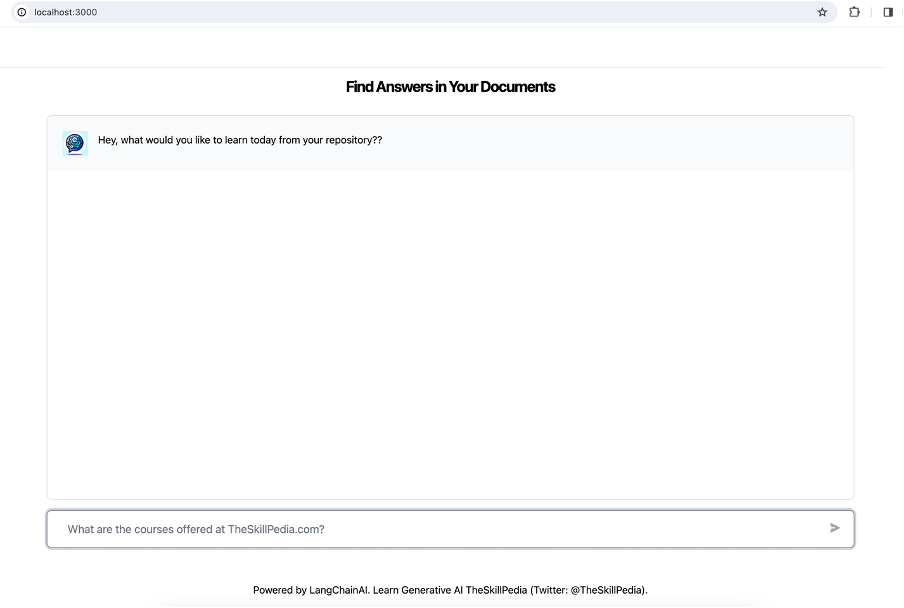

## Cohere, LangChain & Chroma - Create a ChatGPT Chatbot for Your PDF Files

### Introduction
Use the new Cohere API to build a chatbot for multiple Large PDF files.

This repository used  LangChain, Chroma, Typescript, and Next.js. LangChain is a framework that makes it easier to build scalable AI/LLM apps and chatbots. Chroma is a vectorstore for storing embeddings and your PDF in text to later retrieve similar docs.

This is an application of a RAG PDF chatbot using the powerful Cohere API. With an emphasis on reproducibility, this project offers a detailed narrative on the entire process, starting with the initial setup and concluding with a deployed chatbot.

The application build a RAG PDF Chatbot from your PDF Files. It will create chunck and store them in the Chroma Vector Database. 

### Pre Requisite

- What all you need
- 
### Working


Below is the flowchart using LangChains and a bird's-eye view of the process, which involves preparing the training data and integrating it into a application or service. It then moves into the core of the process by covering the selection of an appropriate programming language and installing the necessary Cohere SDK, accompanied by clear instructions and potential pitfalls to watch out for.

The project uses Chroma vector database, Cohere Command-r Model, Embed Model and Chat endpoint.


**1. Install [Docker Desktop](https://www.docker.com/products/docker-desktop/) for your platform.**

**2. Fork the repo to your Github account, so that you can change the code and add/finetune the features.**

[https://github.com/Sangwan70/cohere-chatbot-pdf-langchain.git](https://github.com/Sangwan70/cohere-chatbot-pdf-chroma.git)

**3. Clone the forked repo or download the ZIP to machine**

git clone https://github.com/Sangwan70/cohere-chatbot-pdf-chroma.git

**4. Change to cloned repository and Install packages**

```
cd cohere-chatbot-pdf-chroma

npm install yarn -g
```
to install yarn globally.

Then run:

```
yarn install

```
After installation, you should see a node_modules folder.

**5. Set up your .env file. Copy .env.example into .env Your .env file should look like this:**

```
COHERE_API_KEY=
COLLECTION_NAME=skillpedia
```
**If you run into errors, please review the troubleshooting section further down this page.**

Prelude: Please make sure you have already downloaded node on your system and the version is 18 or greater.

## Development

- Choose a collection name where you'd like to store your embeddings in Chroma. This collection will later be used for queries and retrieval.
- [Chroma details](https://docs.trychroma.com/getting-started)

6. In `utils/makechain.ts` chain change the `QA_PROMPT` for your own usecase.

7. In a new terminal window, run Chroma in the Docker container:

```
docker run -d -p 8000:8000 chromadb/chroma:0.4.15
```

## Convert your PDF files to embeddings

**This repo can load multiple PDF files**

8. Inside `docs` folder, add your pdf files or folders that contain pdf files.

9. Run the script
    ```
   npm run ingest
    ```
   to 'ingest' and embed your docs. If you run into errors troubleshoot below.

## Run the app

Once you've verified that the embeddings and content have been successfully added to Chroma db, you can run the app
```
npm run dev
```
to launch the local dev environment, and then type a question in the chat interface.

## Troubleshooting

In general, keep an eye out in the `issues` and `discussions` section of this repo for solutions.

**General errors**

- Make sure you're running the latest Node version. Run `node -v`
- Try a different PDF or convert your PDF to text first. It's possible your PDF is corrupted, scanned, or requires OCR to convert to text.
- `Console.log` the `env` variables and make sure they are exposed.
- Check that you've created an `.env` file that contains your valid (and working) API keys, environment and index name.
- If you change `modelName` in `ChatCohere`, make sure you have access to the api for the appropriate model.
- Make sure you have enough Cohere API credits and a valid card on your billings account.
- Check that you don't have multiple Cohere API keys in your global environment. If you do, the local `env` file from the project will be overwritten by systems `env` variable.
- Try to hard code your API keys into the `process.env` variables if there are still issues.

To launch the local dev environment, and then type a question in the chat interface.

Launch the browser and open http://localhost:3000


